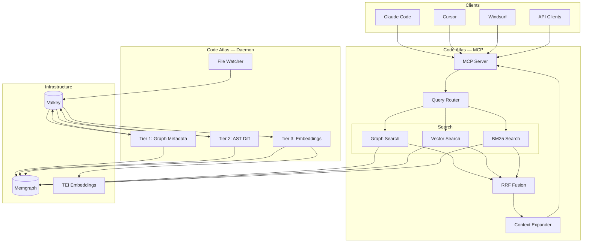
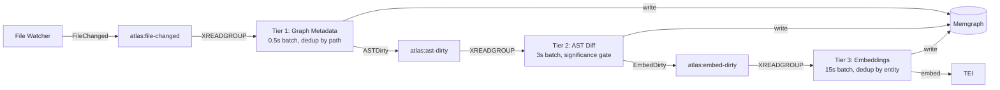

# Code Atlas Architecture

This document describes the architecture of Code Atlas, a code intelligence graph system that indexes codebases and
exposes them via MCP tools for AI coding agents.

## System Overview

Code Atlas combines three search paradigms in a unified system:

- **Graph traversal** — follow relationships (calls, inheritance, imports)
- **Semantic search** — find code by meaning via embeddings
- **BM25 keyword search** — exact matches for identifiers and strings

All powered by Memgraph as a single backend, exposed through an MCP server. An event-driven pipeline with Valkey
(Redis-compatible) Streams keeps the index fresh as code changes.



## Component Architecture

### MCP Server

The MCP server is the primary interface for AI agents. Every capability is MCP-first; the CLI calls the same code paths.
Spawned per agent session via `atlas mcp`, it reads Memgraph directly with no dependency on the daemon.

**Query tools:**

- `cypher_query` — Execute raw Cypher queries against Memgraph
- `text_search` — BM25 keyword search via Memgraph's Tantivy
- `vector_search` — Semantic search via Memgraph's vector index
- `hybrid_search` — All three search types with RRF fusion
- `get_node` — Retrieve a node by qualified name (supports suffix matching)
- `get_context` — Get a node with surrounding context (class, module, callers)

**Index tools:**

- `index` — Trigger indexing of a project
- `status` — Check index health and staleness

**Admin tools:**

- `health` — Infrastructure health check
- `schema_info` — Describe available node types and relationships

### Event-Driven Pipeline

The indexing pipeline is event-driven, with three tiers of increasing cost connected via Valkey (Redis) Streams. Each
tier pulls at its own pace, deduplicates within its batch window, and gates downstream work based on significance.



**Tier 1 — Graph Metadata** (cheap, ~0.5s batch): Updates file node timestamps and staleness flags. Always publishes
`ASTDirty` downstream.

**Tier 2 — AST Diff** (medium, ~3s batch): Re-parses AST via Rust parser, diffs entities, updates graph nodes/edges.
Evaluates a significance gate — trivial changes (whitespace, formatting) stop here; semantic changes (signature, body,
docstring) publish `EmbedDirty` to Tier 3.

**Tier 3 — Embeddings** (expensive, ~15s batch): Re-embeds affected entities via TEI, writes vectors to Memgraph.
Deduplicates by entity qualified name across all events in the batch.

**Significance Gate (Tier 2 → 3):**

- Whitespace/formatting only → stop
- Non-docstring comment → stop
- Docstring changed → gate through
- Body changed beyond threshold → gate through
- Signature changed → always gate through
- Entity added/deleted → always gate through

**Error handling:** Failed batches are not acknowledged — Redis re-delivers via the pending entries list (PEL).

See [ADR-0004](adr/0004-event-driven-tiered-pipeline.md) for full rationale.

### Indexing Pipeline

The indexing pipeline transforms source code into a searchable graph. Each stage feeds into the next:

1. **File Scanner** — Walks the project tree, applying exclusion rules (`.gitignore`, `.atlasignore`, `atlas.toml`
   scope). Outputs a list of files to process.
2. **Rust Parser** — Parses each file's AST via tree-sitter, extracts entities (classes, functions, methods, imports)
   and their relationships. Outputs structured JSON.
3. **Pattern Detectors** — Pluggable detectors that identify implicit patterns: decorator-based routing, event handlers,
   test-to-code mapping, method overrides.
4. **Embedder** — Batches entities for embedding via TEI. Uses a content-hash cache to skip unchanged code. Operates on
   logical chunks (functions, classes, doc sections).
5. **Graph Writer** — Batch-writes nodes and edges to Memgraph. Updates vector and BM25 indices.

### Query Pipeline

When an agent issues a query:

1. **Query Router** analyzes the query and dispatches to one or more search backends (graph, vector, BM25) in parallel.
2. **RRF Fusion** merges results from all backends using Reciprocal Rank Fusion scoring.
3. **Context Expander** walks the graph around top results — up the hierarchy (class → module → package), along call
   chains, and into documentation links.
4. **Token Assembler** packs expanded results into a response within the configured token budget, prioritizing by
   relevance.

## Graph Schema

### Node Types

**Code nodes:** Project, Package, Module, Class, Function, Method — forming a containment hierarchy (Project → Package →
Module → Class/Function, Class → Method).

**Documentation nodes:** DocFile, DocSection, ADR — linked to code via DOCUMENTS and AFFECTS edges.

**Dependency nodes:** ExternalPackage, ExternalSymbol — representing imported libraries and their symbols.

### Relationships

```mermaid
erDiagram
    Project ||--o{ Package : CONTAINS
    Package ||--o{ Module : CONTAINS
    Module ||--o{ Class : DEFINES
    Module ||--o{ Function : DEFINES
    Class ||--o{ Method : DEFINES_METHOD
    Class ||--o{ Class : INHERITS

    Function ||--o{ Function : CALLS
    Method ||--o{ Function : CALLS
    Method ||--o{ Method : CALLS

    Module ||--o{ ExternalPackage : IMPORTS
    Function ||--o{ ExternalSymbol : USES_TYPE

    DocSection ||--o{ Function : DOCUMENTS
    DocSection ||--o{ Class : DOCUMENTS
    ADR ||--o{ Module : AFFECTS

    Function ||--o{ Route : HANDLES_ROUTE
    Function ||--o{ Event : HANDLES_EVENT
    Function ||--o{ Class : TESTS
    Method ||--o{ Method : OVERRIDES
```

**Structural:** CONTAINS, DEFINES, DEFINES_METHOD, INHERITS — the containment and type hierarchy.

**Call/Data:** CALLS, IMPORTS, USES_TYPE — runtime and compile-time dependencies.

**Documentation:** DOCUMENTS, AFFECTS — links between docs/ADRs and code entities.

**Patterns:** HANDLES_ROUTE, HANDLES_EVENT, TESTS, OVERRIDES — implicit relationships made explicit by pattern
detectors.

## Deployment

Code Atlas uses a **hybrid deployment model**: a long-running daemon handles continuous indexing, while a lightweight
MCP server is spawned per agent session.

```bash
docker compose up -d           # Memgraph (7687) + TEI (8080) + Valkey (6379)
atlas daemon start             # File watcher + tier consumers (long-running)
atlas mcp                      # MCP server — stdio (Claude Code, Cursor)
atlas mcp --transport http     # MCP server — Streamable HTTP (VS Code, JetBrains)
```

The daemon publishes file change events to Valkey Streams, where tier consumers process them and write to Memgraph. The
MCP server reads Memgraph directly — no dependency on the daemon for queries, so agents can query immediately even with
a stale index.

On startup, the daemon runs a reconciliation pass: compares filesystem state against the index and enqueues stale files
through the pipeline progressively (Tier 1 first, then 2, then 3).

See [ADR-0005](adr/0005-deployment-process-model.md) for full rationale.

## Technology Stack

| Layer      | Technology         | Purpose                            |
| ---------- | ------------------ | ---------------------------------- |
| CLI        | Typer              | Command-line interface             |
| MCP        | mcp-python         | Model Context Protocol server      |
| Config     | Pydantic           | Configuration management           |
| Parsing    | Tree-sitter (Rust) | Fast AST parsing                   |
| Graph DB   | Memgraph           | Graph storage + vector + BM25      |
| Event Bus  | Valkey (Redis)     | Pipeline streams + embedding cache |
| Embeddings | TEI / LiteLLM      | Code embeddings                    |
| HTTP       | httpx              | Async HTTP client                  |
| Tokens     | tiktoken           | Token counting                     |

## Security

- **Local-first**: All data stays on the developer's machine
- **No external calls by default**: TEI runs locally in Docker
- **Optional cloud embeddings**: LiteLLM fallback requires explicit config
- **No telemetry**: No usage data sent anywhere
- **Git-aware**: Respects .gitignore, never indexes secrets

## Performance Targets

| Operation                | Target  | Notes                       |
| ------------------------ | ------- | --------------------------- |
| Full index (10K files)   | < 60s   | Parallelized parsing        |
| Delta index (10% change) | < 10s   | Entity-level diffing        |
| Simple query (p95)       | < 100ms | Single search type          |
| Hybrid query (p95)       | < 300ms | Three search types + fusion |
| Memory (100K nodes)      | < 2GB   | Memgraph in-memory          |

## Accepted Architectural Decisions

- **[ADR-0004](adr/0004-event-driven-tiered-pipeline.md)**: Event-driven tiered pipeline with Redis Streams,
  significance gating, per-consumer batch policies
- **[ADR-0005](adr/0005-deployment-process-model.md)**: Hybrid deployment — daemon + agent-spawned MCP, stdio/Streamable
  HTTP transport

## Future Considerations

- **Language expansion**: Additional tree-sitter grammars
- **Distributed indexing**: For very large monorepos
- **Remote Memgraph**: Team-shared graph instance
- **Custom detectors**: User-defined pattern plugins
- **IDE integration**: Real-time indexing via file watchers
