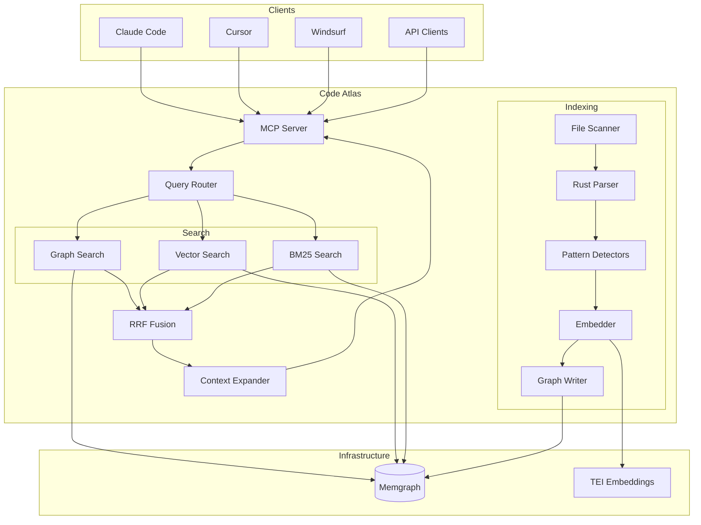
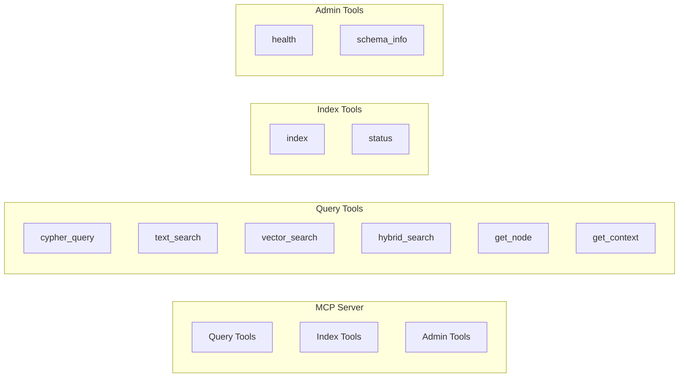
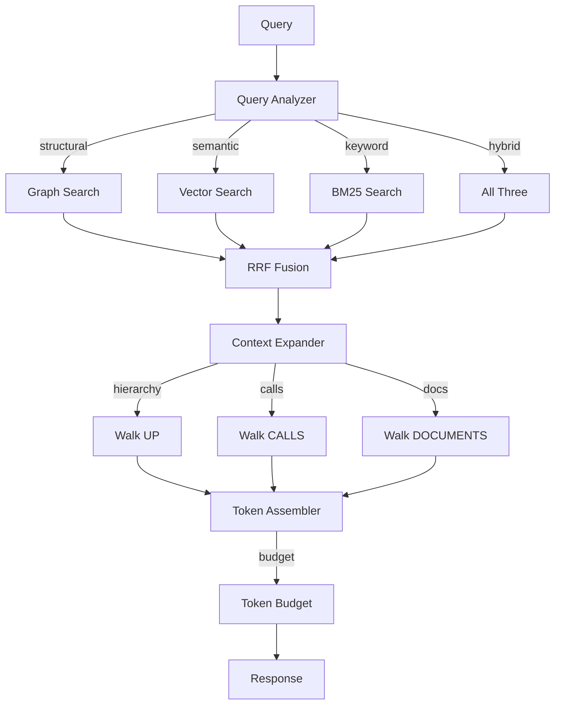
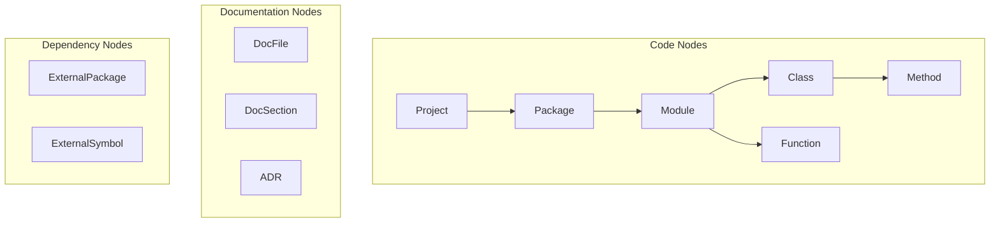
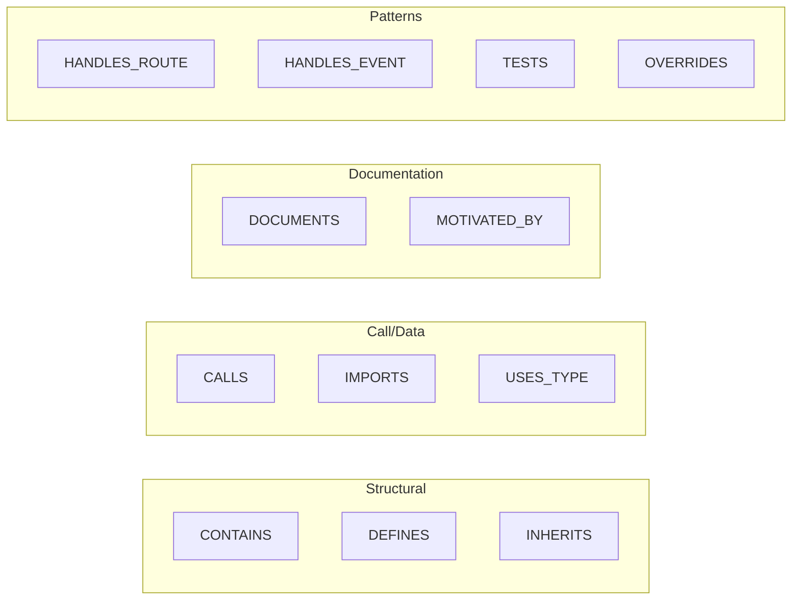
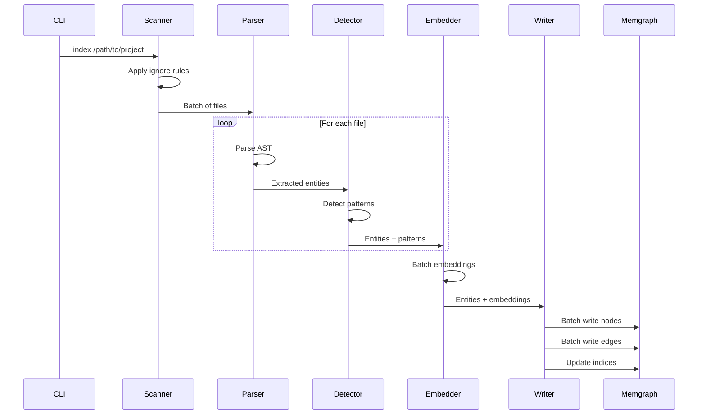
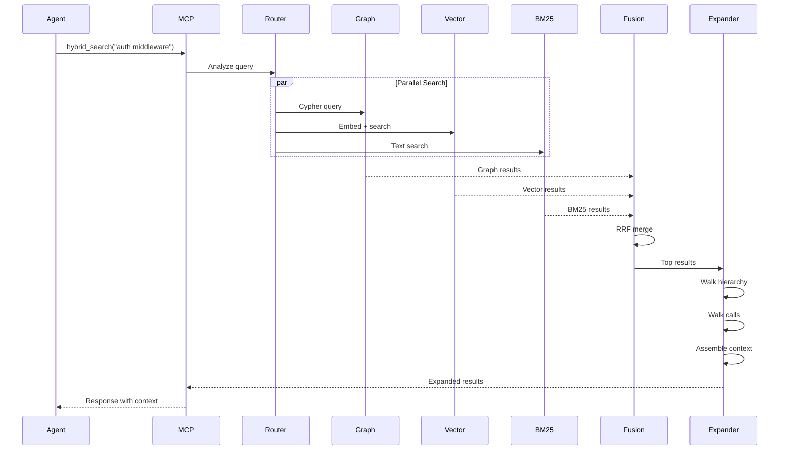
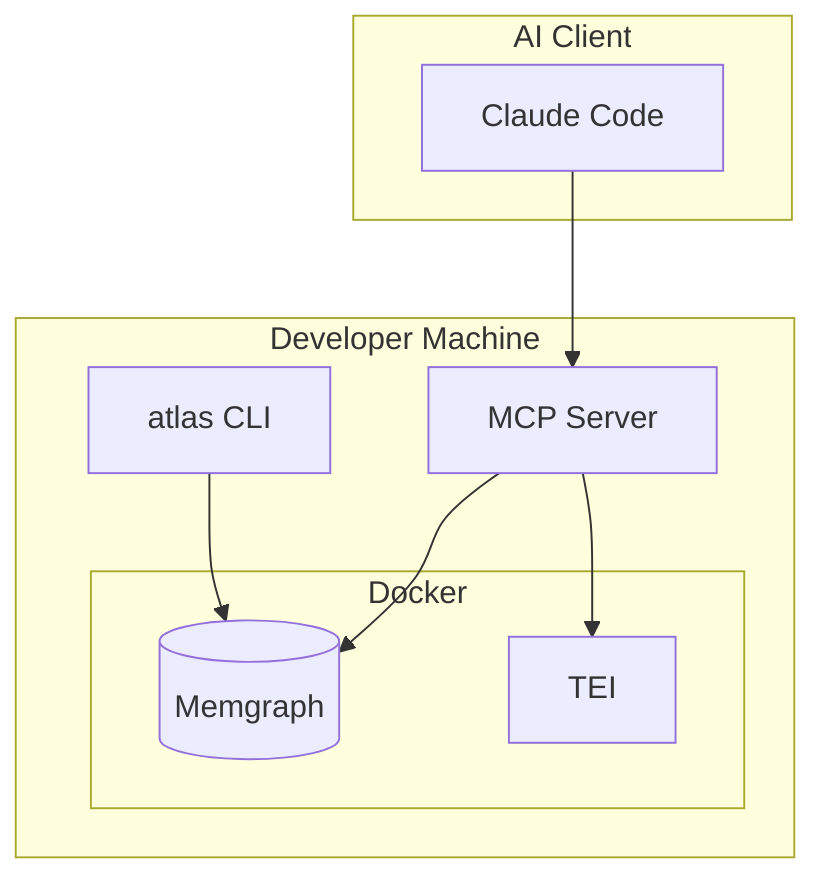
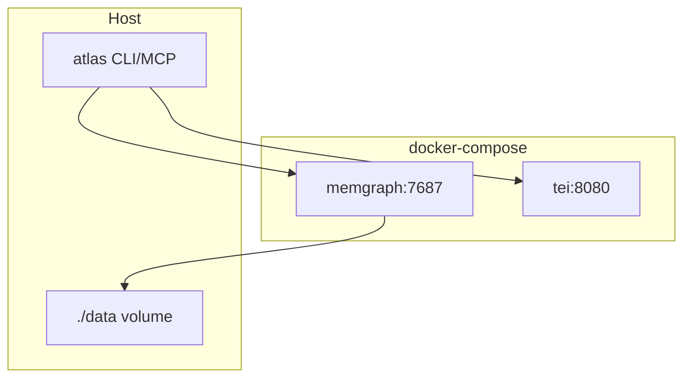

# Code Atlas Architecture

This document describes the architecture of Code Atlas, a code intelligence graph system that indexes codebases and exposes them via MCP tools for AI coding agents.

## System Overview

Code Atlas combines three search paradigms in a unified system:

- **Graph traversal** — follow relationships (calls, inheritance, imports)
- **Semantic search** — find code by meaning via embeddings
- **BM25 keyword search** — exact matches for identifiers and strings

All powered by Memgraph as a single backend, exposed through an MCP server.



## Component Architecture

### MCP Server

The MCP server is the primary interface for AI agents. It exposes tools for querying the code graph and managing the index.



### Indexing Pipeline

The indexing pipeline transforms source code into a searchable graph.

```mermaid
flowchart LR
    subgraph Input
        SRC[Source Files]
        DOC[Documentation]
        CFG[Config Files]
    end

    subgraph "File Scanner"
        GI[.gitignore]
        AI[.atlasignore]
        AT[atlas.toml]
    end

    subgraph "Rust Parser"
        TS[Tree-sitter]
        AST[AST Extraction]
        ENT[Entity Detection]
    end

    subgraph "Pattern Detectors"
        DR[Decorator Routing]
        EH[Event Handlers]
        TM[Test Mapping]
        CO[Class Overrides]
    end

    subgraph "Embedder"
        BC[Batch Collector]
        TE[TEI Client]
        EC[Embedding Cache]
    end

    subgraph "Graph Writer"
        NW[Node Writer]
        EW[Edge Writer]
        IU[Index Updater]
    end

    SRC --> GI
    DOC --> GI
    GI --> AI
    AI --> AT
    AT --> TS

    TS --> AST
    AST --> ENT
    ENT --> DR
    DR --> EH
    EH --> TM
    TM --> CO

    CO --> BC
    BC --> TE
    TE --> EC
    EC --> NW
    NW --> EW
    EW --> IU
    IU --> MG[(Memgraph)]
```



### Query Pipeline

The query pipeline handles search requests and assembles context.



## Graph Schema

### Node Types



### Relationships



### Full Schema Diagram

```mermaid
erDiagram
    Project ||--o{ Package : CONTAINS
    Package ||--o{ Module : CONTAINS
    Module ||--o{ Class : DEFINES
    Module ||--o{ Function : DEFINES
    Class ||--o{ Method : DEFINES_METHOD
    Class ||--o{ Class : INHERITS

    Function ||--o{ Function : CALLS
    Method ||--o{ Function : CALLS
    Method ||--o{ Method : CALLS

    Module ||--o{ ExternalPackage : IMPORTS
    Function ||--o{ ExternalSymbol : USES_TYPE

    DocSection ||--o{ Function : DOCUMENTS
    DocSection ||--o{ Class : DOCUMENTS
    ADR ||--o{ Module : AFFECTS

    Function ||--o{ Route : HANDLES_ROUTE
    Function ||--o{ Event : HANDLES_EVENT
    Function ||--o{ Class : TESTS
    Method ||--o{ Method : OVERRIDES
```

## Data Flow

### Indexing Flow



### Query Flow



## Deployment Architecture

### Local Development



### Docker Compose Setup



## Technology Stack

| Layer | Technology | Purpose |
|-------|------------|---------|
| CLI | Typer | Command-line interface |
| MCP | mcp-python | Model Context Protocol server |
| Config | Pydantic | Configuration management |
| Parsing | Tree-sitter (Rust) | Fast AST parsing |
| Graph DB | Memgraph | Graph storage + vector + BM25 |
| Embeddings | TEI / LiteLLM | Code embeddings |
| HTTP | httpx | Async HTTP client |
| Tokens | tiktoken | Token counting |

## Security Considerations

- **Local-first**: All data stays on the developer's machine
- **No external calls by default**: TEI runs locally in Docker
- **Optional cloud embeddings**: LiteLLM fallback requires explicit config
- **No telemetry**: No usage data sent anywhere
- **Git-aware**: Respects .gitignore, never indexes secrets

## Performance Characteristics

| Operation | Target | Notes |
|-----------|--------|-------|
| Full index (10K files) | < 60s | Parallelized parsing |
| Delta index (10% change) | < 10s | Entity-level diffing |
| Simple query (p95) | < 100ms | Single search type |
| Hybrid query (p95) | < 300ms | Three search types + fusion |
| Memory (100K nodes) | < 2GB | Memgraph in-memory |

## Future Considerations

- **Language expansion**: Additional tree-sitter grammars
- **Distributed indexing**: For very large monorepos
- **Remote Memgraph**: Team-shared graph instance
- **Custom detectors**: User-defined pattern plugins
- **IDE integration**: Real-time indexing via file watchers
